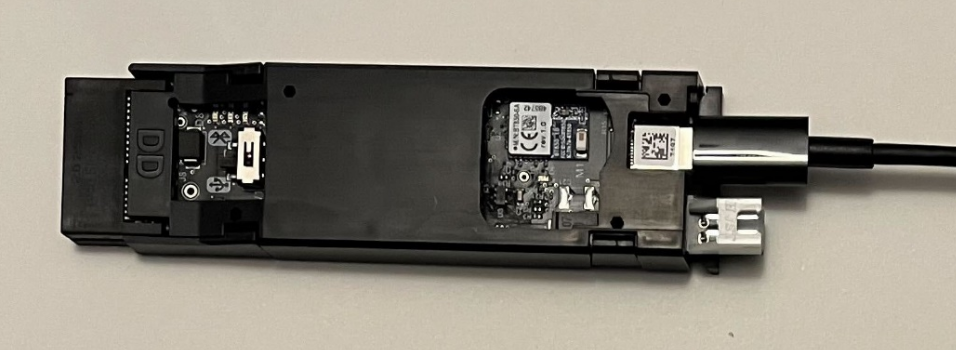
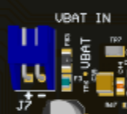

# Create3

Connection of the User Interface board with the Create 3 robot is only through the VBATT connector J7, which uses JST XH-style connector. The connector has been marked with Positive and Negative signs on the board (Positive being pin 1). The VBAT line is fused with a PTC fuse rated at 2A. 

<figure class="aligncenter">
    
    <figcaption>Create 3 Power Adapter</figcaption>
</figure>

<figure class="aligncenter">
    
    <figcaption>TurtleBot 4 UI Board Power Connector</figcaption>
</figure>