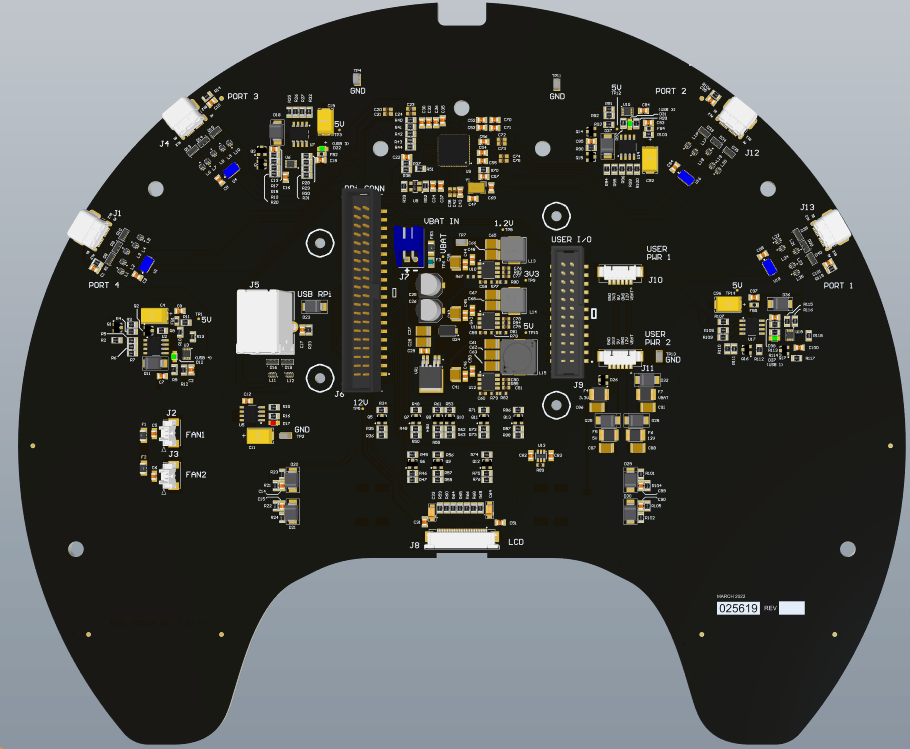
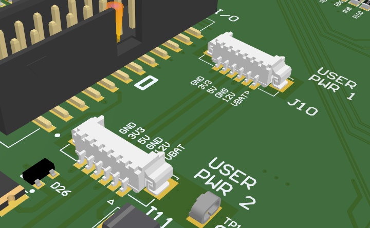
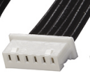

# PCBA

The TurtleBot 4 comes with an additional UI board that expands on the Raspberry Pi 4 functionality to give the user ease of control over the Create® 3 robot and Raspberry Pi and to act as an expansion board for addons, sensors, gadgets the user might have in mind to utilize.

<figure class="aligncenter">
    
    <figcaption>TurtleBot 4 User Interface Board</figcaption>
</figure>

It houses;

| # | Connector                 | Availability          |
|:--|:--------------------------|:----------------------|
| 4 | USB-C Ports               | Available to the user |
| 1 | User I/O expansion header | Available to the user |
| 2 | Fan Connectors            | Available to the user |
| 2 | User Power Connectors     | Available to the user |

## Available I/O

The standard Turtlebot 4 has a 2X20 pin internal connector, connecting it to the RPi via a flex cable, and another 2X12 pin connector allowing the user to access the remaining GPIOs and a set of 5V, and 3.3V power coming from the RPi.

The IO interface between the 2X20 connector and 2X12 connector and the available GPIOs to the user are shown in Table 1a, and 1b.

Table 1a:

| GPIO # | Function      | Pin # | Pin # | Function      | GPIO # |
|:-------|:--------------|:------|:------|:--------------|:-------|
|        | 3V3_RPi       | 1     | 2     | 5V_RPi        |        |
| GPIO2  | USER_PORT     | 3     | 4     | 5V_RPi        |        |
| GPIO3  | USER_PORT     | 5     | 6     | GND           |        |
| GPIO4  | SDA           | 7     | 8     | USER_PORT     | GPIO14 |
|        | GND           | 9     | 10    | USER_PORT     | GPIO15 |
| GPIO17 | PWR_LED       | 11    | 12    | MTR_LED       | GPIO18 |
| GPIO27 | COMM_LED      | 13    | 14    | GND           |        |
| GPIO22 | BATT_GRN_LED  | 15    | 16    | BATT_LED      | GPIO23 |
|        | 3V3_RPi       | 17    | 18    | WIFI_LED      | GPIO24 |
| GPIO10 | USER_PORT     | 19    | 20    | GND           |        |
| GPIO9  | USER_PORT     | 21    | 22    | USER1_GRN_LED | GPIO25 |
| GPIO11 | USER_PORT     | 23    | 24    | USER_PORT     | GPIO8  |
|        | GND           | 25    | 26    | USER_PORT     | GPIO7  |
| GPIO0  | EEPROM_SD     | 27    | 28    | EEPROM_SC     | GPIO1  |
| GPIO5  | SCL           | 29    | 30    | GND           |        |
| GPIO6  | USER2_GRN_LED | 31    | 32    | USER_PORT     | GPIO12 |
| GPIO13 | DISPLAY-RST   | 33    | 34    | GND           |        |
| GPIO19 | USER_SW1      | 35    | 36    | USER_SW2      | GPIO16 |
| GPIO26 | USER_SW3      | 37    | 38    | USER_SW4      | GPIO20 |
|        | GND           | 39    | 40    | USER2_RED_LED | GPIO21 |

```note
ALL USER_PORTs are routed to the 2X12 Auxiliary connectors
```

Table 1b:

| GPIO # | Function  | Pin # | Pin # | Function  | GPIO # |
|:-------|:----------|:------|:------|:----------|:-------|
|        | 3V3_RPi   | 1     | 2     | 5V_RPi    |        |
| GPIO2  | USER_PORT | 3     | 4     | 5V_RPi    |        |
| GPIO3  | USER_PORT | 5     | 6     | GND       |        |
|        | GND       | 7     | 8     | USER_PORT | GPIO14 |
|        | 3V3_RPi   | 9     | 10    | USER_PORT | GPIO15 |
| GPIO0  | EEPROM_SD | 11    | 12    | USER_PORT | GPIO1  |
| GPIO10 | USER_PORT | 13    | 14    | GND       |        |
| GPIO9  | USER_PORT | 15    | 16    | GND       |        |
| GPIO11 | USER_PORT | 17    | 18    | USER_PORT | GPIO8  |
|        | GND       | 19    | 20    | USER_PORT | GPIO7  |
|        | GND       | 21    | 22    | USER_PORT | GPIO12 |
|        | GND       | 23    | 24    | GND       |        |

In addition to these GPIO ports, the User has two additional power ports available supplying 3.3V, 5V, 12V, VBATT (14.4V), and two grounds each. 

<figure class="aligncenter">
    
    <figcaption>TurtleBot 4 Additional Power Ports</figcaption>
</figure>

The two connectors are both 6-Pin Molex PicoBlade P/N 0532610671. The cable assembly needed to use these connectors are P/N 0151340602.

<figure class="aligncenter">
    
    <figcaption>Power Connector</figcaption>
</figure>

| Pin # | Voltage  |
|:------|:---------|
| 1     | VBAT     |
| 2     | 12V      |
| 3     | GND      |
| 4     | 5V       |
| 5     | 3V3      |
| 6     | GND      |
