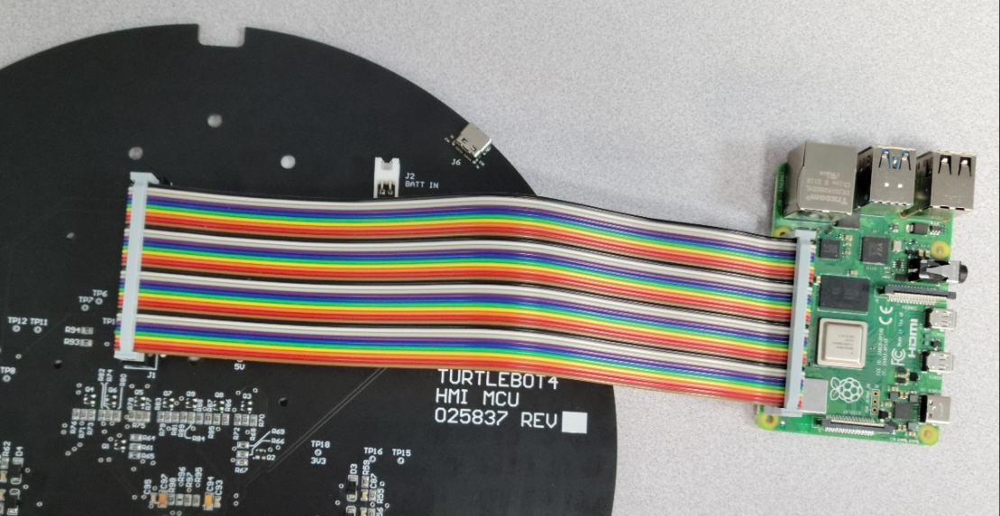
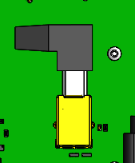

# Raspberry Pi 4B

Connection with RPi is through the large 40 pin connector and through a short USB-B cable. The USB-B type cable enables communication to 4 USB-C ports on the UI board.  
The ribbon cable connecting the two stretches out from the Left of the board as seen here and bends upwards to connect to the 40-pin on the UI board. 

<figure class="aligncenter">
    
    <figcaption>TurtleBot 4 UI Board to Raspberry Pi connector</figcaption>
</figure>

The TurtleBot 4 comes with a USB-A to USB-B 3.0 cable to connect the UI board and RPi. Without this connection the USB-C ports will not be able to communicate. They will be able to supply power regardless though.

<figure class="aligncenter">
    
    <figcaption>TurtleBot 4 UI Board USB type B connector</figcaption>
</figure>