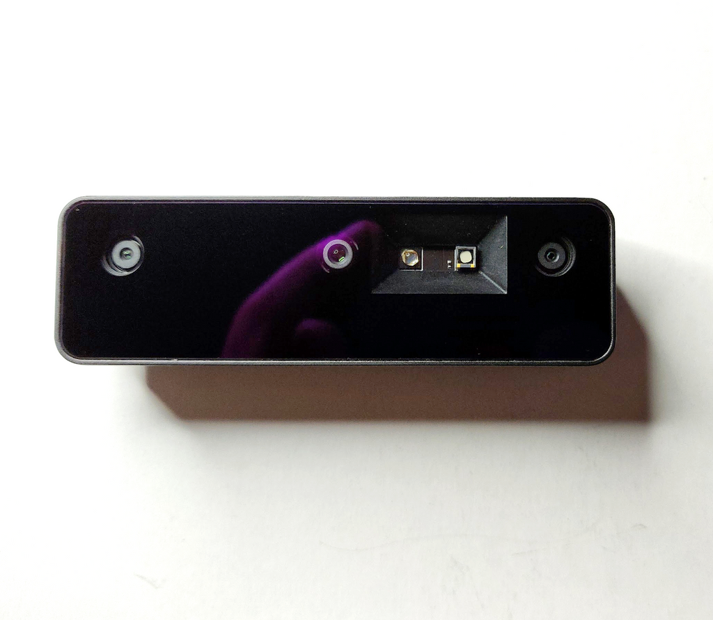
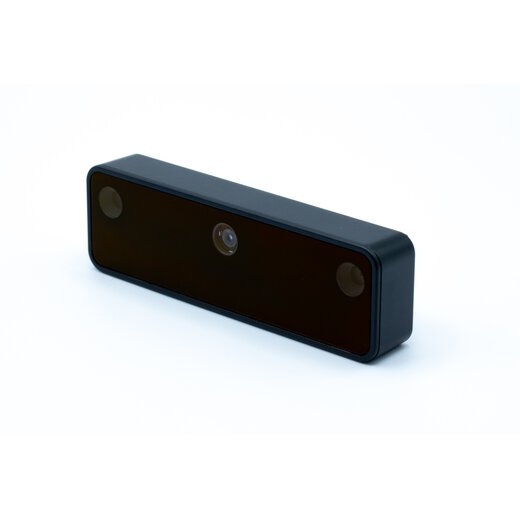

# Features

## Hardware Specifications
TODO: ENTER CORRECT VALUES

| Feature                  | Lite                                                             | Standard                                                                      |
|:-------------------------|:-----------------------------------------------------------------|:------------------------------------------------------------------------------|
| Size (L x W x H)         | 138mm x 178mm x 192mm                                            | 281mm x 306mm x 141mm                                                         |
| Weight                   | 1kg                                                              | 1.8kg                                                                         |
| Base platform            | iRobot Create3®                                                  | iRobot Create3®                                                               |
| On-board Computer        | Raspberry Pi 4B 4Gb                                              | Raspberry Pi 4B 4Gb                                                           |
| Maximum linear velocity  | 0.46 m/s                                                         | 0.46 m/s                                                                      |
| Maximum angular velocity | 2.84 rad/s (162.72 deg/s)                                        | 1.82 rad/s (104.27 deg/s)                                                     |
| Maximum payload          | 15kg                                                             | 30kg                                                                          |
| Operation time           | 2h 30m                                                           | 2h                                                                            |
| Charging time            | 2h 30m                                                           | 2h 30m                                                                        |
| Bluetooth Controller     | -                                                                | Yes                                                                           |
| Lidar                    | RPLIDAR A1M8                                                     | RPLIDAR A1M8                                                                  |
| Camera                   | OAK-D-Lite                                                       | OAK-D-Pro                                                                     |
| Power connectors         | 3.3V / 800mA 5V / 4A 12V / 1A                            | 3.3V / 800mA 5V / 4A 12V / 1A                                         |
| Expansion ports          | USB 2.0 x1   USB 3.0 x1                                      | USB 2.0 x1   USB 3.0 x1   USB-C x4                                    |
| Programmable LEDs        | Create3® Lightring                                               | Create3® Lightring   User LED x2                                          |
| Status LEDs              | -                                                                | Power LED   Motors LED   WiFi LED   Comms LED   Battery LED   |
| Buttons and Switches     | Create3® User buttons x2   Create3® Power Button x1          | Create3® User buttons x2   Create3® Power Button x1   User Buttons x4 |
| Battery                  | Lithium polymer 11.1V 1800mAh / 19.98Wh 5C                       | Lithium polymer 11.1V 1800mAh / 19.98Wh 5C                                    |
| Dock                     | Input : 100-240V, AC 50/60Hz, 1.5A @max Output : 12V DC, 5A | Input : 100-240V, AC 50/60Hz, 1.5A @max Output : 12V DC, 5A              |

## Turtlebot4 Standard

## Turtlebot4 Lite

## Sensors

### RPLIDAR A1M8

The RPLIDAR A1M8 is a 360 degree Laser Range Scanner with a 12m range. It is used to generate a 2D scan of the robots surroundings.
Both the Turtlebot4 Lite and Standard use this sensor. For more information, click [here.](https://www.slamtec.com/en/Lidar/A1)

### OAK-D-Pro

### OAK-D-Lite

