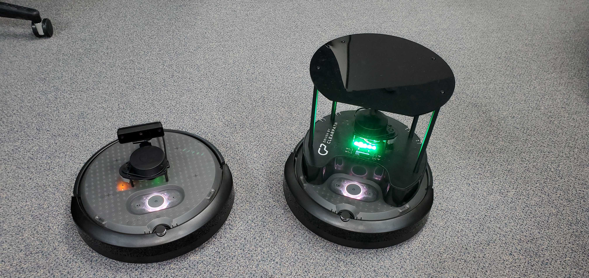

# Features

# Turtlebot4 Standard

# Turtlebot4 Lite

# Sensors

## RPLIDAR A1M8

The RPLIDAR A1M8 is a 360 degree Laser Range Scanner with a 12m range. It is used to generate a 2D scan of the robots surroundings.
Both the Turtlebot4 Lite and Standard use this sensor. For more information, click [here.](https://www.slamtec.com/en/Lidar/A1)

## OAK-D-Pro

## OAK-D-Lite

