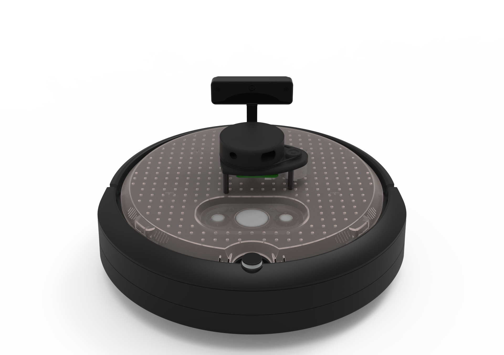
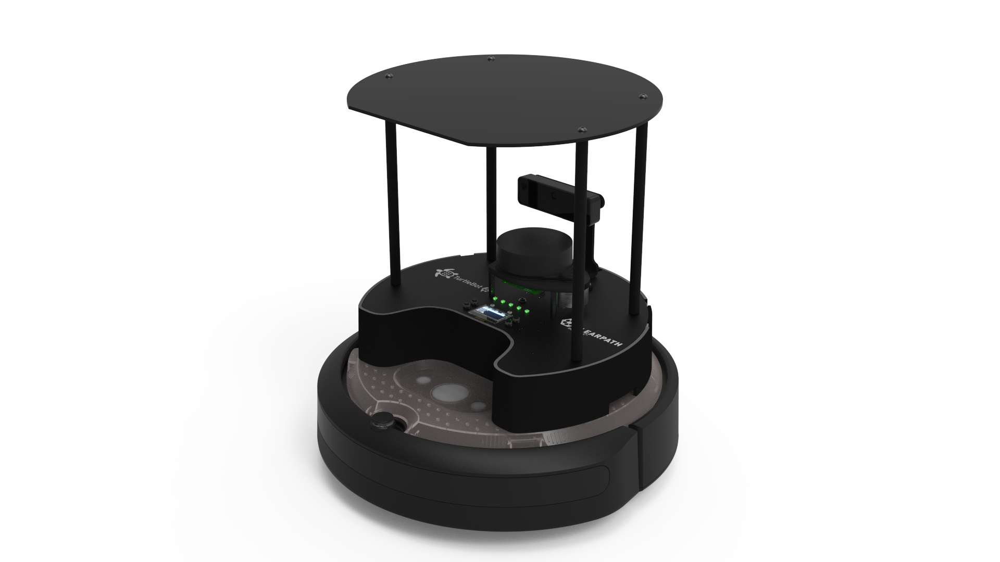
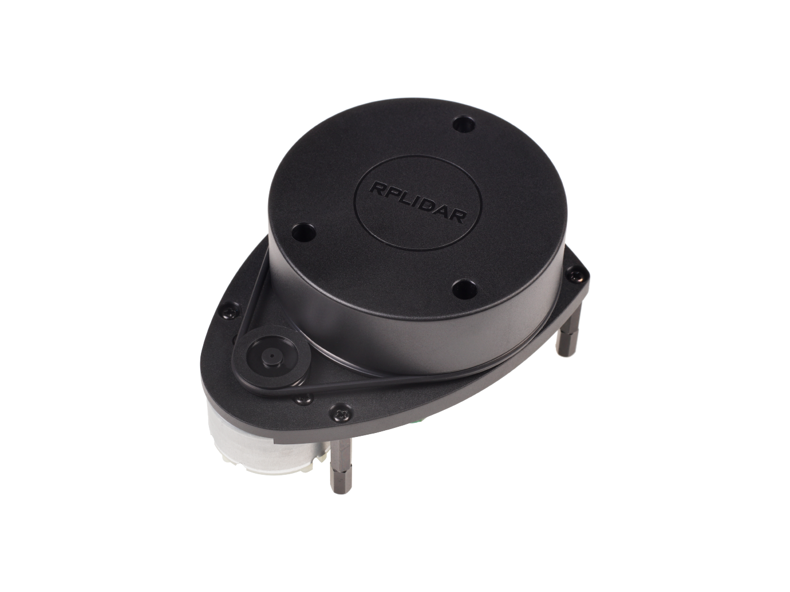
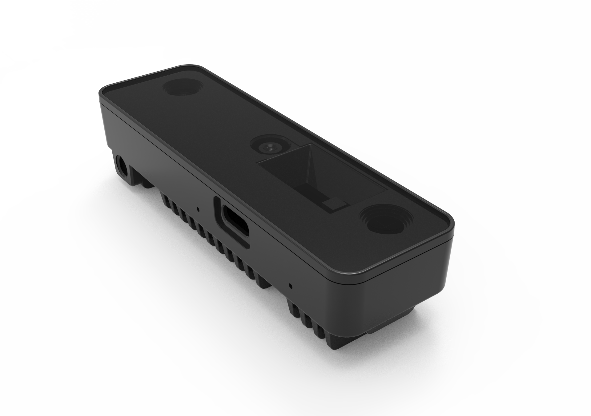
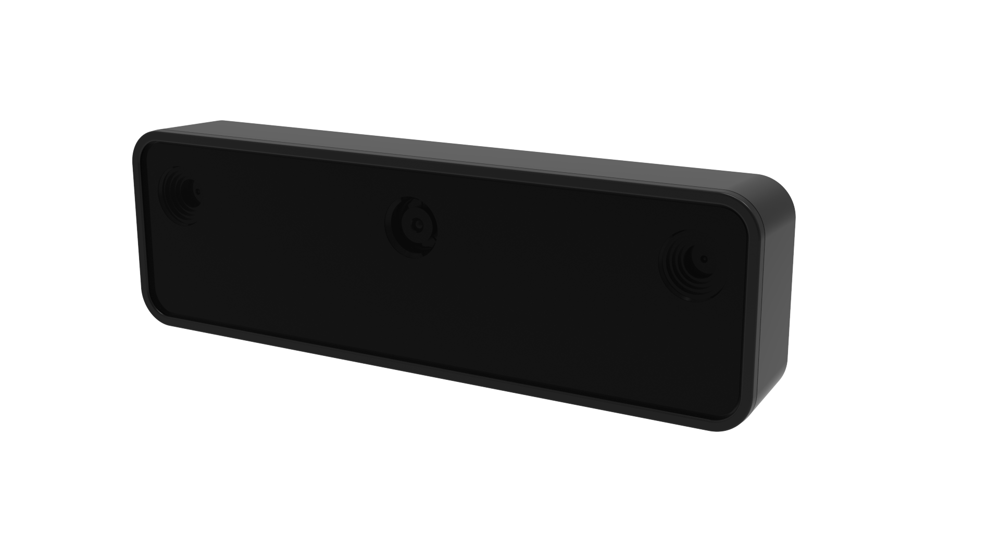

# Features

## Hardware Specifications

| Feature                  | Lite  | Standard  |
|:-------------------------|:------------------------------------------------------------------------------------------------------|:------------------------------------------------------------------------------------------------------------------|
| Size (L x W x H)         | 342 x 339 x 192 mm                                                                                    | 342 x 339 x 351 mm                                                                                                |
| Weight                   | 3270 g                                                                                                | 3945 g                                                                                                            |
| Base platform            | iRobot Create® 3                                                                                      | iRobot Create® 3                                                                                                  |
| Wheels (Diameter)        | 72 mm                                                                                                 | 72 mm                                                                                                             |
| Ground Clearance         | 4.5 mm                                                                                                | 4.5mm                                                                                                             |
| On-board Computer        | Raspberry Pi 4B 4Gb                                                                                   | Raspberry Pi 4B 4Gb                                                                                               |
| Maximum linear velocity  | 0.31 m/s in safe mode, 0.46 m/s without safe mode                                                     | 0.31 m/s in safe mode, 0.46 m/s without safe mode                                                                 |
| Maximum angular velocity | 1.90 rad/s                                                                                            | 1.90 rad/s                                                                                                        |
| Maximum payload          | 9-15kg (depending on location of payload)                                                             | 9-15kg (depending on location of payload)                                                                         |
| Operation time           | 2h 30m - 4h depending on load                                                                         | 2h 30m - 4h depending on load                                                                                     |
| Charging time            | 2h 30m                                                                                                | 2h 30m                                                                                                            |
| Bluetooth Controller     | -                                                                                                     | Turtlebot4 Controller                                                                                             |
| Lidar                    | RPLIDAR A1M8                                                                                          | RPLIDAR A1M8                                                                                                      |
| Camera                   | OAK-D-Lite                                                                                            | OAK-D-Pro                                                                                                         |
| User Power               | VBAT @ 1.9A   5V @ Low current   3.3v @ Low current                                           | VBAT @ 300 mA   12V @ TBD mA   5V @ 500 mA   3.3v @ 250 mA                                            |
| Expansion ports          | USB 2.0 x2   USB 3.0 x2                                                                           | USB 2.0 x2   USB 3.0 x2   USB-C x4                                                                        |
| Programmable LEDs        | Create® 3 Lightring                                                                                   | Create® 3 Lightring   User LED x2                                                                             |
| Status LEDs              | -                                                                                                     | Power LED   Motors LED   WiFi LED   Comms LED   Battery LED                                       |
| Buttons and Switches     | Create® 3 User buttons x2   Create® 3 Power Button x1                                             | Create® 3 User buttons x2   Create® 3 Power Button x1   User Buttons x4                                   |
| Battery                  | 26 Wh Lithium Ion (14.4V nominal)                                                                     | 26 Wh Lithium Ion (14.4V nominal)                                                                                 |
| Dock                     | Included                                                                                              | Included                                                                                                          |

## Turtlebot4 Standard

## Turtlebot4 Lite

## Sensors

### RPLIDAR A1M8

The RPLIDAR A1M8 is a 360 degree Laser Range Scanner with a 12m range. It is used to generate a 2D scan of the robots surroundings.
Both the Turtlebot4 Lite and Standard use this sensor. For more information, click [here.](https://www.slamtec.com/en/Lidar/A1)

### OAK-D-Pro

### OAK-D-Lite

