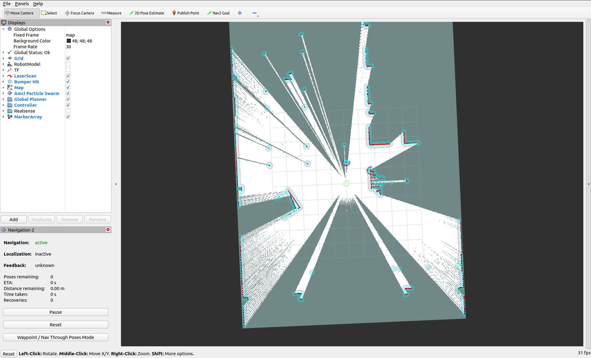

# Rviz2

Rviz2 is a port of Rviz to ROS2. It provides a graphical interface for users to view their robot, sensor data, maps, and more. It is installed by default with ROS2 and requires a desktop version of Ubuntu to use.

`turtlebot4_desktop` provides launch files and configurations for viewing the TurtleBot 4 in Rviz2.

## View Model

To inspect the model and sensor data, run `ros2 launch turtlebot4_viz view_model.launch.py`.

TODO: Fix meshes in Rviz and add screenshots.

## View Robot

For a top down view of the robot in its environment, run `ros2 launch turtlebot4_viz view_robot.launch.py`.

This is useful when mapping or navigating with the robot

<figure class="aligncenter">
    
    <figcaption>Rviz2 launched with the View Robot configuration</figcaption>
</figure>
