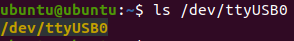

# Sensors

## RPLIDAR A1M8

### Connecting

The RPLIDAR connects to the Turtlebot4 with a micro USB cable. The sensor does not require high data throughput, so using a USB 2.0 port is sufficient. 

Once connected, the RPLIDAR should register on the Raspberry PI as a USB device, `/dev/ttyUSB0`

To check that the USB device exists, use the command

```bash
ls /dev/ttyUSB0
```

If the device exists, the terminal will echo `/dev/ttyUSB0`:



## OAK-D Lite

## OAK-D Pro

## Create3

### Cliff

### Bumper

### Wheeldrop

### IR Proximity

### Slip

### Stall

### Kidnap