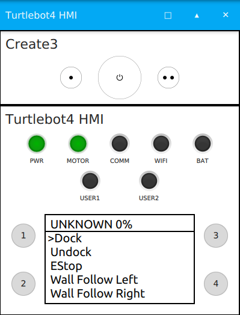

# Turtlebot4 Packages

The Turtlebot4 has 4 main repositories for software: [`turtlebot4`](https://github.com/turtlebot/turtlebot4), [`turtlebot4_robot`](https://github.com/turtlebot/turtlebot4_robot), [`turtlebot4_desktop`](https://github.com/turtlebot/turtlebot4_desktop), and [`turtlebot4_simulator`](https://github.com/turtlebot/turtlebot4_simulator). Each repository is also a [metapackage](http://wiki.ros.org/Metapackages) and contains one or more ROS2 packages.

## Turtlebot4

The `turtlebot4` metapackage contains common packages that are used by both `turtlebot4_robot` and `turtlebot4_simulator`.

### Description

The `turtlebot4_description` package contains the URDF description of the robot and the mesh files for each component.

The description can be published with the `robot_state_publisher`.

### Messages

The `turtlebot4_msgs` package contains the custom messages used on the Turtlebot4:

* [UserButton](https://github.com/turtlebot/turtlebot4/blob/galactic/turtlebot4_msgs/msg/UserButton.msg): User Button states.
* [UserLed](https://github.com/turtlebot/turtlebot4/blob/galactic/turtlebot4_msgs/msg/UserLed.msg): User Led control.
* [UserDisplay](https://github.com/turtlebot/turtlebot4/blob/galactic/turtlebot4_msgs/msg/UserDisplay.msg): User Display data.

The Turtlebot4 can also use all of the messages, actions, and services that the iRobot® Create3® platform supports. See [irobot_create_msgs](https://github.com/iRobotEducation/irobot_create_msgs) for more details.

### Navigation

The `turtlebot4_navigation` packages contains launch and configuration files for using SLAM and navigation on the Turtlebot4.

Launch files:
* [Nav Bringup](): Launches navigation. Allows for launch configurations to use SLAM, Nav2, and localization.
* [SLAM Sync](https://github.com/turtlebot/turtlebot4/blob/galactic/turtlebot4_navigation/launch/slam_sync.launch.py): Launches `slam_toolbox` with online synchronous mapping. Recommended for use on a PC.
* [SLAM Async](https://github.com/turtlebot/turtlebot4/blob/galactic/turtlebot4_navigation/launch/slam_async.launch.py): Launches `slam_toolbox` with online asynchronous mapping. Recommended for use on the Raspberry Pi 4.

Nav Bringup launch configuration options:
- **namespace**: Top-level namespace.
    - default: *None*
- **use_namespace**: Whether to apply a namespace to the navigation stack.
    - options: *true, false*
    - default: *false*
- **slam**: Whether to launch SLAM.
    - options: *off, sync, async*
    - default: *off*
- **localization**: Whether to launch localization.
    - options: *true, false*
    - default: *false*
- **nav2**: Whether to launch Nav2.
    - options: *true, false*
    - default: *false*
- **map**: Full path to map yaml file to load.
    - default: */path/to/turtlebot4_navigation/maps/depot.yaml*
- **use_sim_time**: Use simulation (Gazebo) clock if true.
    - options: *true, false*
    - default: *false*
- **param_file**: Full path to the ROS2 parameters file to use for nav2 and localization nodes.
    - default: */path/to/turtlebot4_navigation/config/nav2.yaml*
- **autostart**: Automatically startup the nav2 stack.
    - options: *true, false*
    - default: *true*
- **use_composition**: Whether to use composed bringup.
    - options: *true, false*
    - default: *true*

Running synchronous SLAM:
```bash
ros2 launch turtlebot4_navigation nav_bringup.launch.py slam:=sync
```

Running asynchronous SLAM with Nav2:
```bash
ros2 launch turtlebot4_navigation nav_bringup.launch.py slam:=async nav2:=true
```

Running Nav2 with localization and existing map:
```bash
ros2 launch turtlebot4_navigation nav_bringup.launch.py localization:=true nav2:=true map:=/path/to/map.yaml
```

### Node

The `turtlebot4_node` package contains the source code for the [rclcpp](https://github.com/ros2/rclcpp) node `turtlebot4_node` that controls the robots HMI as well as other logic. This node is used by both the physical robot, and the simulator robot.

Publishers:
- **/hmi/display**: *turtlebot4_msgs/msg/UserDisplay*
    - description: The current information that is to be displayed (Standard model only).
- **/ip**: *std_msgs/msg/String*
    - description: The IP address of the Wi-Fi interface. 

Subscribers:
- **/battery_state**: *sensor_msgs/msg/BatteryState*
    - description: Current battery state of the Create 3.
- **/hmi/buttons**: *turtlebot4_msgs/msg/UserButton*
    - description: Button states of the Turtlebot4 HMI (Standard model only).
- **/hmi/display/message**: *std_msgs/msg/String*
    - description: User topic to print custom message to display (Standard model only).
- **/hmi/led**: *turtlebot4_msgs/msg/UserLed*
    - description: User topic to control User LED 1 and 2 (Standard model only).
- **/interface_buttons**: *irobot_create_msgs/msg/InterfaceButtons*
    - description: Button states of Create 3 buttons.
- **/joy**: *sensor_msgs/msg/Joy*
    - description: Bluetooth controller button states (Standard model only).
- **/wheel_status**: *irobot_create_msgs/msg/WheelStatus*
    - description: Wheel status reported by Create 3.

Service Clients:
- **/e_stop**: *irobot_create_msgs/srv/EStop*
    - description: Enable or disable motor stop.
- **/robot_power**: *irobot_create_msgs/srv/RobotPower*
    - description: Power off the robot.

Action Clients:
- **/e_stop**: *irobot_create_msgs/srv/EStop*
- **/robot_power**: *irobot_create_msgs/srv/RobotPower*

## Turtlebot4 Robot

The `turtlebot4_robot` metapackage contains packages that are used by the physical Turtlebot4 robot and are run on the robots Raspberry Pi.

### Base

The `turtlebot4_base` package contains the source code for the [rclcpp](https://github.com/ros2/rclcpp) node `turtlebot4_base_node` which runs on the physical robot. This node interfaces with the GPIO lines of the Raspberry Pi which allows it to read the state of the buttons, as well as write to the LEDs and display.

### Bringup

The `turtlebot4_bringup` package contains the launch and configuration files to run the robots software.

Launch files:
* [Joy Teleop](https://github.com/turtlebot/turtlebot4_robot/blob/galactic/turtlebot4_bringup/launch/joy_teleop.launch.py): Launches nodes to enable the bluetooth controller.
* [OAKD](https://github.com/turtlebot/turtlebot4_robot/blob/galactic/turtlebot4_bringup/launch/oakd.launch.py): Launches the OAK-D nodes.
* [RPLIDAR](https://github.com/turtlebot/turtlebot4_robot/blob/galactic/turtlebot4_bringup/launch/rplidar.launch.py): Launches the RPLIDAR node.
* [Robot](https://github.com/turtlebot/turtlebot4_robot/blob/galactic/turtlebot4_bringup/launch/robot.launch.py): Launches the Turtlebot4 nodes.
* [Lite](https://github.com/turtlebot/turtlebot4_robot/blob/galactic/turtlebot4_bringup/launch/lite.launch.py): Launches the Turtlebot4 Lite.
* [Standard](https://github.com/turtlebot/turtlebot4_robot/blob/galactic/turtlebot4_bringup/launch/standard.launch.py): Launches the Turtlebot4 Standard.

Config files:
* [Turtlebot4 Controller](https://github.com/turtlebot/turtlebot4_robot/blob/galactic/turtlebot4_bringup/config/turtlebot4_controller.config.yaml): Configurations for the Turtlebot4 controller.
* [Turtlebot4](https://github.com/turtlebot/turtlebot4_robot/blob/galactic/turtlebot4_bringup/config/turtlebot4.yaml): Configurations for the `turtlebot4_node` and `turtlebot4_base_node`.

### Diagnostics

The `turtlebot4_diagnostics` packages contains the source code and launch files for the Turtlebot4 diagnostics updater.

### Tests

The `turtlebot4_diagnostics` packages contains the source code for the Turtlebot4 system test scripts.

## Turtlebot4 Desktop

The `turtlebot4_desktop` metapackage contains packages used for visualising and interfacing with the Turtlebot4 from a PC.

### Visualisation

The `turtlebot4_viz` package contains launch files and configurations for viewing the robot in Rviz2, and viewing the diagnostics.

Launch files:
* [View Diagnostics](https://github.com/turtlebot/turtlebot4_desktop/blob/galactic/turtlebot4_viz/launch/view_diagnostics.launch.py): Launches `rqt_robot_monitor` to view diagnostic data.
* [View Model](https://github.com/turtlebot/turtlebot4_desktop/blob/galactic/turtlebot4_viz/launch/view_model.launch.py): Launches `rviz2`. Used to view the model and sensor data.
* [View Robot](https://github.com/turtlebot/turtlebot4_desktop/blob/galactic/turtlebot4_viz/launch/view_robot.launch.py): Launches `rviz2`. Used to view the robot while navigating.

## Turtlebot4 Simulator

The `turtlebot4_simulator` metapackage contains packages used to simulate the Turtlebot4 in Ignition Gazebo.

### Ignition Bringup

The `turtlebot4_ignition_bringup` package contains launch files and configurations to launch Ignition Gazebo.

Launch files:
* [Ignition](https://github.com/turtlebot/turtlebot4_simulator/blob/galactic/turtlebot4_ignition_bringup/launch/ignition.launch.py): Launches Ignition Gazebo and all required nodes to run the simulation.
* [ROS Ignition Bridge](https://github.com/turtlebot/turtlebot4_simulator/blob/galactic/turtlebot4_ignition_bringup/launch/ros_ign_bridge.launch.py): Launches all of the required `ros_ign_bridge` nodes to bridge Ignition topics with ROS topics.
* [Turtlebot4 Nodes](https://github.com/turtlebot/turtlebot4_simulator/blob/galactic/turtlebot4_ignition_bringup/launch/turtlebot4_nodes.launch.py): Launches the `turtlebot4_node` and `turtlebot4_ignition_hmi_node` required to control the HMI plugin and robot behaviour.

Ignition launch configuration options:
- **model**: Which Turtlebot4 model to use.
    - options: *standard, lite*
    - default: *standard*
- **rviz**: Whether to launch rviz.
    - options: *true, false*
    - default: *false*
- **slam**: Whether to launch SLAM.
    - options: *off, sync, async*
    - default: *off*
- **nav2**: Whether to launch Nav2.
    - options: *true, false*
    - default: *false*
- **param_file**: Path to parameter file for `turtlebot4_node`.
    - default: */path/to/turtlebot4_ignition_bringup/config/turtlebot4_node.yaml*
- **world**: Which world to use for simulation.
    - default: *depot*
- **robot_name**: What to name the spawned robot.
    - default: *turtlebot4*

Running the simulator with default settings:
```bash
ros2 launch turtlebot4_ignition_bringup ignition.launch.py
```

Running synchronous SLAM with Nav2:
```bash
ros2 launch turtlebot4_ignition_bringup ignition.launch.py slam:=sync nav2:=true rviz:=true
```

### Ignition GUI Plugins

The `turtlebot4_ignition_gui_plugins` package contains the source code for the Turtlebot4 HMI GUI plugin.

The [Turtlebot4 HMI GUI plugin](https://github.com/turtlebot/turtlebot4_simulator/tree/galactic/turtlebot4_ignition_gui_plugins/Turtlebot4Hmi) is only used for the standard model. The lite model uses the [Create3 HMI GUI plugin](https://github.com/iRobotEducation/create3_sim/tree/main/irobot_create_ignition/irobot_create_ignition_plugins/Create3Hmi).

<figure class="aligncenter">
    
    <figcaption>Turtlebot4 HMI GUI plugin</figcaption>
</figure>

### Ignition Toolbox

The `turtlebot4_ignition_toolbox` package contains the source code for the Turtlebot4 HMI node. The Turtlebot4 HMI node acts as a bridge between the `turtlebot4_node` and `ros_ign_bridge` to convert the custom [Turtlebot4 messages](#messages) into standard messages such as `Int32` and `String`.